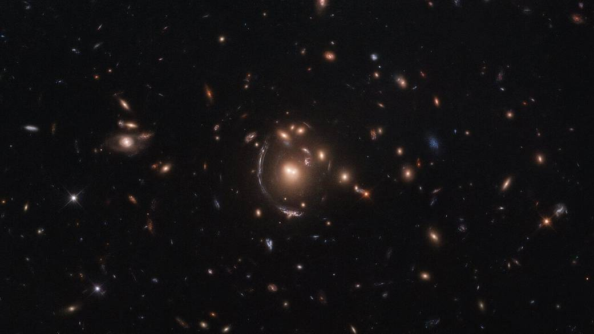
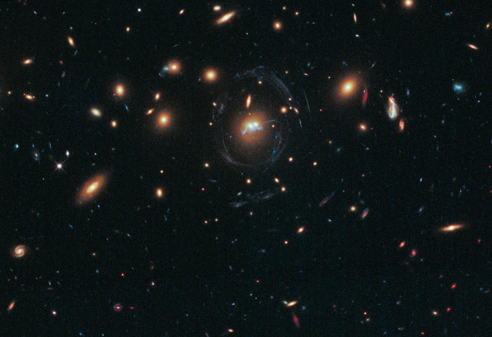

# Qhack_Quantum_Machine_Learning : Classifying existence of galaxy

## This project is to develop a galaxy detection technique from the telescope image via quantum machine learning. 

We successfully demonstrated the detection of the galaxy with an accuracy of 94% via a quantum machine learning model from a NASA image. We divided the galaxy image from NASA into a small 16x16 image as input data. Then we encoded and train the data with a quantum circuit using the parameterized quantum circuit from the paper [Expressibility and entangling capability of parameterized quantum circuits for hybrid quantum-classical algorithms, arXiv:1905. 10876] (https://arxiv.org/abs/1905.10876). With the circuit with high expressibility, we trained and test our model with Cross-Entropy as our loss function and L-BFGS algorithm for optimization. This algorithm is realized in PyTorch and qiskit machine-learning module. This work shows our capability of classification of galaxy images. 

<table align="center">
    <tr>
        <td></td>
        <td></td>
     </tr>
 </table>
 

## Project Description 

In the following project we apply various Quantum algorithms using Qiskit to weather related image data. Our business proposal is also aligned with developing a quantum weathert application. We have also partially implemented a quantum SVM in Pennylane, but it still needs some work.

## The accuracy of model is 94% !!

